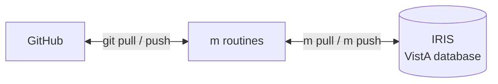
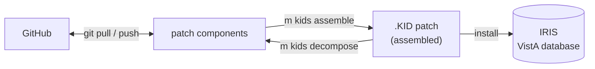
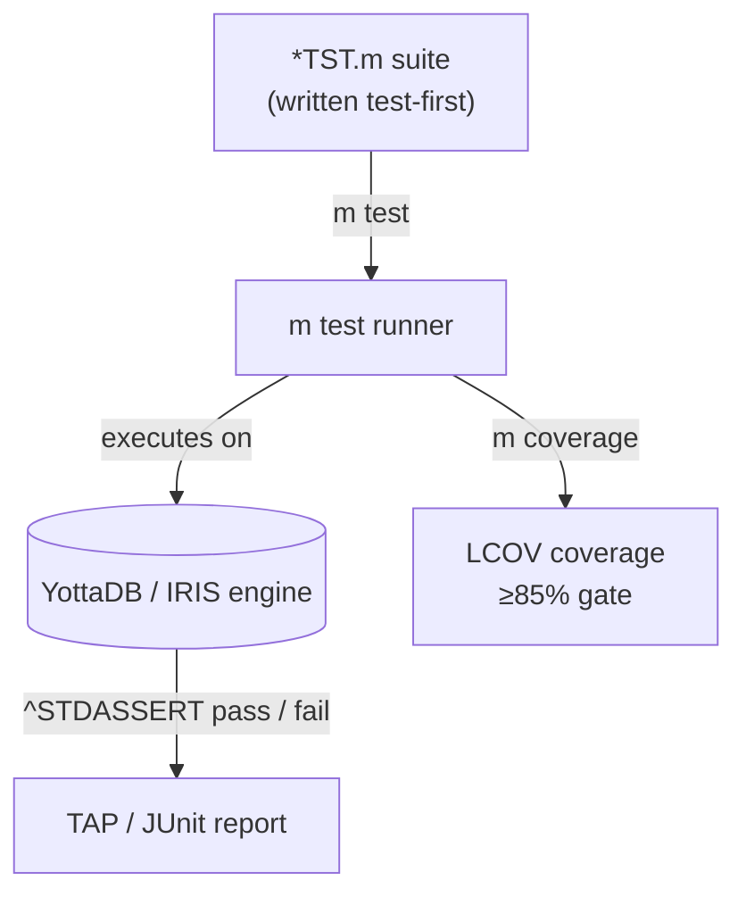
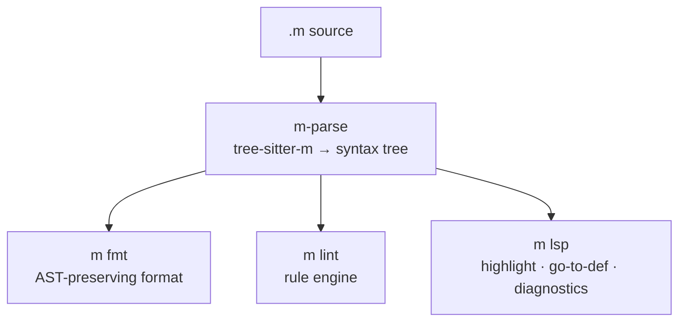
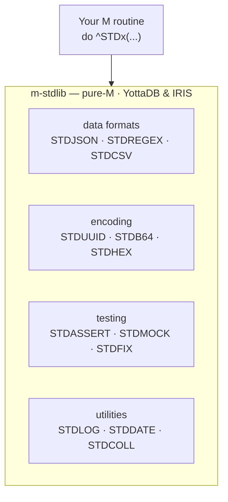
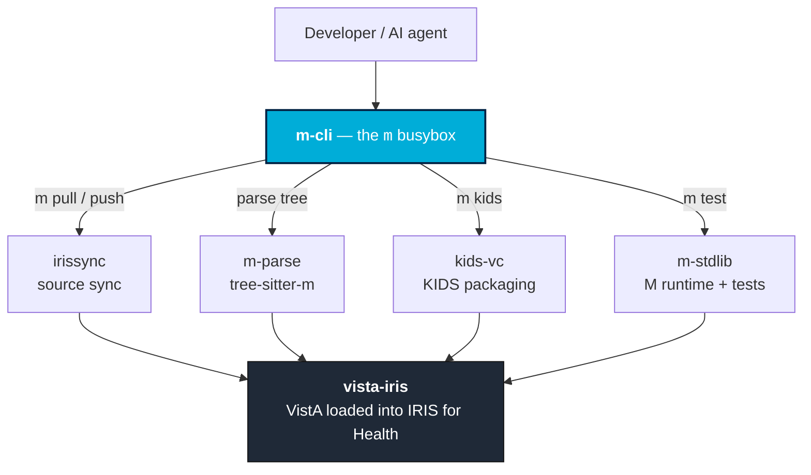
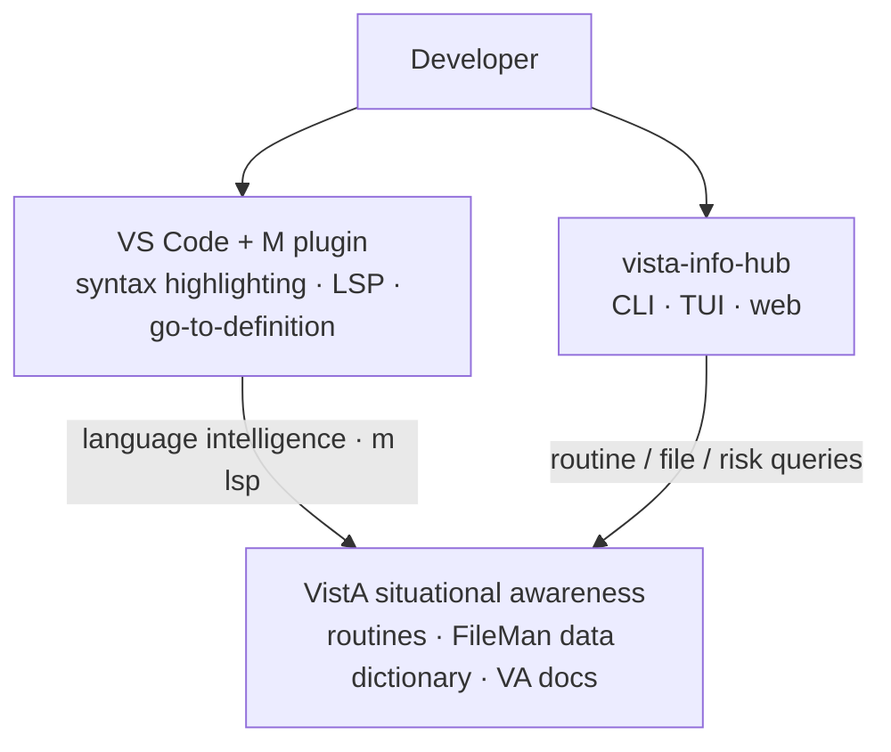

# vista-cloud-dev

**Modernizing VistA-M development on the VA's Health Cloud.**


`vista-cloud-dev` is an ecosystem of small, composable tools that bring present-day software engineering — version control, unit testing, linting, formatting, an IDE language server, and AI-agent surfaces — to **VistA**, the VA's cloud-based federal health information system.

VA's VistA is built on the **M database** running on **Intersystems IRIS** and hosted on the federally-certified **Amazon Web Services** cloud (see: https://cloudvista.github.io).

vista-cloud-dev is **built for IRIS and YottaDB M-developers and is open to the community.** The work is under active development — interfaces are stabilizing but not yet at a tagged stable release.

The guiding principle is simple:

> **Git is the source of truth; the database is just the engine.**

You write `.m` files in git, sync them into a running IRIS (or YottaDB)
instance, test against the live engine, and pull changes back — instead of
treating the database as the place source code "lives."

## Start here

- **New here?** Read **[docs](https://github.com/vista-cloud-dev/docs)** — the
  modernization strategy, the `m-cli` spec, and the toolchain dependency map
  (the *why* behind everything below).
- **Setting up a machine?** Clone the org via
  **[workspace](https://github.com/vista-cloud-dev/workspace)** —
  `./bootstrap.sh` clones every repo and checks out the right branches.
- **Want the tool?** **[m-cli](https://github.com/vista-cloud-dev/m-cli)** is
  the `m` command; its README has install + first-run instructions.
- **Want to help?** See [Contributing](#contributing).

---

## Table of contents

- [Why this exists](#why-this-exists)
- [The four capabilities](#the-four-capabilities)
  - [1 · Version control](#1--version-control)
  - [2 · Modern testing](#2--modern-testing)
  - [3 · M-aware IDE](#3--m-aware-ide)
  - [4 · The standard library](#4--the-standard-library)
- [Architecture at a glance](#architecture-at-a-glance)
- [The components](#the-components)
  - [Strategy & documentation](#strategy--documentation)
  - [The M toolchain (host-side, Go)](#the-m-toolchain-host-side-go)
  - [The IRIS / VistA source bridge](#the-iris--vista-source-bridge)
  - [The M runtime library](#the-m-runtime-library)
  - [Agent & intelligence surfaces](#agent--intelligence-surfaces)
  - [Coordination & scaffolding](#coordination--scaffolding)
- [The `m` command surface](#the-m-command-surface)
- [Design principles](#design-principles)
- [Contributing](#contributing)
- [Shared CI](#shared-ci)

---

## Why this exists

VistA is one of the largest and longest-lived production codebases in the
world, but M development has historically lacked the everyday tooling other
ecosystems take for granted. VA's migration of VistA onto IRIS — inside the
FedRAMP-HIGH VA Enterprise Cloud (AWS GovCloud) — is an opportunity to close
that gap. `vista-cloud-dev` supplies four things M developers don't have today:

| Gap | What we provide |
|-----|-----------------|
| **Version control** | Materialize routines out of IRIS into a git-friendly mirror, edit as `.m`, push back. |
| **Modern testing** | Assertion-based unit tests (`^STDASSERT`) run by `m test` against the live engine, with coverage. |
| **M-aware IDE** | `m fmt`, `m lint`, and an LSP language server built on a real M parser. |
| **A standard library** | `m-stdlib` — JSON, regex, UUIDs, crypto, CSV, dates, collections, and 25+ more, conformance-tested. |

Everything is **engine-neutral** where it can be (works on YottaDB and IRIS)
and **engine-specific** only where it must be (the IRIS source boundary).

---

## The four capabilities

Each gap above, as a flow.

### 1 · Version control

Two things get version-controlled: individual **routines** and whole **KIDS
patches**.

**Routines** — `m pull` / `m push` round-trips M code between IRIS and `.m`
files on the filesystem, which version-control through GitHub like any other
code.



**Patches** — `kids-vc` decomposes a monolithic `.KID` patch into its
components (routines, FileMan data dictionaries, …) so they can be diffed and
stored in GitHub, and assembles them back into an installable `.KID` that is
pushed into IRIS.



### 2 · Modern testing

Write a `*TST.m` suite first, run it with `m test` against the live engine via
`^STDASSERT`, and get machine-readable results plus coverage.



### 3 · M-aware IDE

One parser feeds every editor feature: format, lint, and the language server
all sit on the `m-parse` syntax tree.



### 4 · The standard library

Your M code calls conformance-tested `STD*` modules instead of re-inventing
per-site utilities — the same on YottaDB and IRIS.



---

## Architecture at a glance

A developer or AI agent drives **`m`** — the centerpiece — which fans out to
its four jobs (sync, parse, package, test), all of which act on the
**vista-iris** instance at the bottom.



> Driven directly from a terminal, or by an AI agent through the
> **m-dev-tools-mcp** server (which exposes every `m` command as an MCP tool).
> Underpinning the whole stack: **docs** (strategy/specs), **go-cli-template**
> (the shared `clikit` CLI grammar every binary inherits), and **workspace**
> (the clone-all manifest + bootstrap).

### Situational awareness

A second, read-only track helps you *understand* the VistA codebase while you
work in it — M-aware editing in VS Code, and code/data-model/docs lookups
through **vista-info-hub**.



**Key invariants**

- **Single writer** — `irissync push` is the *only* thing that writes routines
  back into IRIS; everything else (list/pull/status/verify) is read-only by
  construction.
- **Single parser** — `m-parse` is the one M parse engine; `fmt`, `lint`, and
  `lsp` all sit on it. It runs the `tree-sitter-m` grammar as WASM through
  `wazero`, so the whole toolchain stays a static binary with **no CGO**.
- **One command grammar** — every Go binary builds on `go-cli-template`'s
  `clikit`, so they share an identical output contract (`text` | `json` |
  `auto`), error model, and exit-code ladder. `m` aggregates them all via
  `m schema`, which is exactly what `m-dev-tools-mcp` reflects to agents.

---

## The components

### Strategy & documentation

| Repo | Role |
|------|------|
| **[docs](https://github.com/vista-cloud-dev/docs)** | The living design/strategy corpus — the *why* and *how* of the whole effort: the modernization strategy, the `m-cli` spec, ADRs, the dev-bridge design, and the toolchain dependency map. |
| **[doc-framework](https://github.com/vista-cloud-dev/doc-framework)** | A portable documentation standard + zero-dependency Python validator. Defines eight document types (spec, adr, investigation, research, plan, guide, log, map), enforces frontmatter, cross-references, and supersession in CI. |

### The M toolchain (host-side, Go)

| Repo | Role |
|------|------|
| **[m-cli](https://github.com/vista-cloud-dev/m-cli)** | The `m` busybox — one static Go binary that fronts the whole toolchain. Native commands (`fmt`, `lint`, `lsp`, `test`, `coverage`, `watch`) plus dispatched sibling namespaces (`m pull/push/…` → irissync, `m kids …` → kids-vc). Cross-engine: YottaDB **and** IRIS. |
| **[m-parse](https://github.com/vista-cloud-dev/m-parse)** | The engine-neutral M parse substrate. Embeds the `tree-sitter-m` grammar as WASM and runs it through `wazero` (pure-Go) so the toolchain has zero C dependencies at runtime. Powers `fmt`/`lint`/`lsp`. |
| **[go-cli-template](https://github.com/vista-cloud-dev/go-cli-template)** | The shared Go CLI scaffold (`clikit`): a consistent command grammar, `--output text\|json\|auto`, deterministic exit codes (0 ok · 1 runtime · 2 usage · 3 check · 4 refused), TTY-gated styling, and a reflected `schema` contract. Every binary in the org inherits it. |

### The IRIS / VistA source bridge

| Repo | Role |
|------|------|
| **[irissync](https://github.com/vista-cloud-dev/irissync)** | Owner of the IRIS source boundary, in both directions. Materializes routines from an IRIS namespace into a git-friendly mirror + verifiable manifest (read side, safe by construction), and writes edited routines back (`push`, gated by single-writer locks + manifest conflict checks). Talks Atelier REST; enterprise auth (PIV/OIDC, mTLS). |
| **[kids-vc](https://github.com/vista-cloud-dev/kids-vc)** | Version control for VistA **KIDS** distributions. Decomposes a monolithic `.KID` patch into a per-component tree you can diff and merge in git, and reassembles it byte-identically. Includes a PIKS data-class **lint gate** that refuses to package Patient/Institution-class FileMan data (PHI/PII guard). |
| **[vista-iris](https://github.com/vista-cloud-dev/vista-iris)** | A reproducible **VistA-on-IRIS** container. The full site build (routine/global import + FileMan/Kernel install) is baked into the image, so it boots an already-loaded, operational instance — Management Portal, RPC Broker, HL7 MLLP, and Atelier REST for irissync to connect to. Ships **fictitious test data only**. |

### The M runtime library

| Repo | Role |
|------|------|
| **[m-stdlib](https://github.com/vista-cloud-dev/m-stdlib)** | A **pure-M standard library** — the batteries M never shipped. 32 conformance-tested modules: `STDJSON`, `STDREGEX`, `STDUUID`, `STDB64`/`STDHEX`, `STDCSV`, `STDDATE`, `STDLOG`, `STDARGS`, `STDCOLL`, `STDURL`, `STDFS`, plus the TDD primitives (`STDASSERT`, `STDFIX`, `STDMOCK`, `STDSEED`) that `m test` runs on, and optional callout-backed modules (`STDCRYPTO`, `STDCOMPRESS`, `STDHTTP`). Runs identically on YottaDB and IRIS. |

### Agent & intelligence surfaces

| Repo | Role |
|------|------|
| **[m-dev-tools-mcp](https://github.com/vista-cloud-dev/m-dev-tools-mcp)** | A thin **Model Context Protocol** server over the `m` toolchain. Reads `m schema`, exposes every command as an MCP tool, and forwards calls with `--output json` — so an AI agent drives `fmt`/`lint`/`test`/sync through one surface. Safety profiles (`default` / `safe` excludes `push` / `all`). |
| **[vista-info-hub](https://github.com/vista-cloud-dev/vista-info-hub)** | A **VistA introspection engine** — one binary, many faces (CLI, MCP, REST, web UI, TUI) for querying the VistA code and data model plus the VA Document Library. `vista routine …`, `vista context …` (AI-ready markdown), `vista search …` (FTS5), `vista risk …`. A single operation registry projects to every interface. |


### Coordination & scaffolding

| Repo | Role |
|------|------|
| **[workspace](https://github.com/vista-cloud-dev/workspace)** | The coordination hub: a clone-all manifest (`repos.txt`), an idempotent `bootstrap.sh` for new machines, and `git-update-repos` to fast-forward every repo. Start here on a fresh checkout. |

---

## The `m` command surface

`m` is a busybox: native commands live in `m-cli`; sibling namespaces are
dispatched to standalone binaries discovered at runtime (`$M_<NAME>_BIN`, then
alongside `m`, then `$PATH`). Missing siblings degrade to stubs so the schema
stays valid.

```
m fmt        AST-preserving formatter (shape-checked: parse(fmt(x)) == parse(x))
m lint       query-driven rule engine over the parse tree
m lsp        M language server (LSP 3.x over stdio)
m test       run *TST.m suites via the engine, ^STDASSERT, TAP/JUnit output
m coverage   line + branch coverage → LCOV
m watch      re-run lint/fmt (and tests) on change
m schema     emit the aggregated command tree as JSON (agent discovery)

m list|pull|status|verify|push        → irissync   (push is the sole DB writer)
m kids decompose|assemble|roundtrip|lint|parse  → kids-vc
```

Install and first-run instructions live in the
**[m-cli](https://github.com/vista-cloud-dev/m-cli)** README; machine setup and
the end-to-end pull → edit → test → push workflow live in
**[workspace](https://github.com/vista-cloud-dev/workspace)**.

---

## Design principles

- **Git-canonical source.** The database is the engine, not the repository.
- **Engine-neutral by default.** YottaDB and IRIS are both first-class; only
  the IRIS source boundary (`irissync`) is engine-specific.
- **Static, dependency-free binaries.** `CGO_ENABLED=0` everywhere — even the M
  parser runs as WASM via `wazero`, so there is no libc/C toolchain at runtime.
- **One contract, many surfaces.** A single command grammar (`clikit`) and a
  reflected `schema` mean CLI flags, MCP tools, and JSON envelopes never drift.
- **Safe by construction.** Read verbs can't mutate the database; the single
  writer is locked and conflict-checked; KIDS packaging refuses PHI/PII.
- **Conformance-tested.** `m-stdlib` modules ship with vendored RFC/NIST
  corpuses and an ≥85% coverage gate per module.
- **Machine-reviewable docs.** Every design doc is validated in CI by
  `doc-framework`.

---

## Contributing

Contributions are welcome. The org-wide guides live in this `.github` repo:

- [Contributing guide](https://github.com/vista-cloud-dev/.github/blob/main/CONTRIBUTING.md)
- [Code of Conduct](https://github.com/vista-cloud-dev/.github/blob/main/CODE_OF_CONDUCT.md)
- [Security policy](https://github.com/vista-cloud-dev/.github/blob/main/SECURITY.md)

The codebase is licensed under **Apache-2.0**, with two deliberately isolated
exceptions (the MIT VS Code extensions and the AGPL-derived embedded grammar
artifact in `m-parse`) — see
[`NOTICE`](https://github.com/vista-cloud-dev/.github/blob/main/NOTICE).

> **Not affiliated with or endorsed by the US Department of Veterans Affairs.**
> "VistA" refers to the public-domain VA health information system. These tools
> operate on VistA source and ship with **fictitious test data only** — never
> load real patient (PHI/PII) data into instances used with them.

---

## Shared CI

Go repos call the reusable workflow in this repo:

```yaml
uses: vista-cloud-dev/.github/.github/workflows/go-ci.yml@main
```
